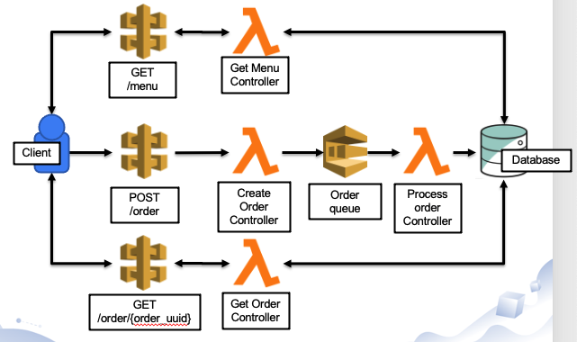
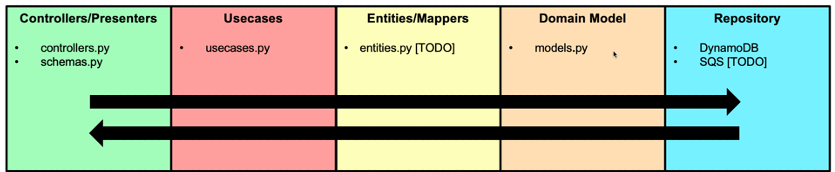

# serverless-flask-tdd

TDD implementation of serverless architecture using serverless framework and flask on AWS. This REST dummy project also use SQS and DynamoDB

## Get started

Install project dependencies and start local server.

```#!/bin/bash
mkdir .venv; pipenv install
export FLASK_APP=src.app
export AWS_ACCESS_KEY_ID=12345
export AWS_SECRET_ACCESS_KEY=12345
pipenv run flask run
```

## Project Architecture and Requirements

### Name: **Order-Taker**

Create an application that will:

- Return available items
- Accept and validate orders from customer
- Process valid orders
- Return order status



## Design Pattern

This project follows the [Clean Architecture](https://blog.cleancoder.com/uncle-bob/2012/08/13/the-clean-architecture.html) concept (loosely).


## Dependency Management

**Pipenv** manages the python dependencies which are specified in `Pipfile`.
> Generated `Pipfile.lock` should be committed to ensure the consistency of every deployment.

```#!/bin/bash
# install python dependencies (including dev packages)
mkdir .venv; pipenv install -d

# or
# install python and serverless framework dependencies

sh utilities/install_dependencies.sh

# run a script under virtual environment
pipenv run pytest -v

#or
# activate shell in a virtual environment
pipenv shell

# add runtime dependencies
pipenv install {package_name}

# add dev dependencies
pipenv install {package_name} --dev
```

## Config Management

TODO

## Commit Testing

> Testing and linting settings can be configured in `tox.ini` file.

### Unit Testing

**Pytest** is the main tool for unit testing. It also relies on other packages such as:

- `pytest-cov` for code coverage
- `pytest-dotenv` for faking configs
- `moto` for in-memory AWS requests
- `py-event-mocks` for AWS Lambda event stubs

```#!/bin/bash
# run unit tests
pytest
```

### Source code analysis

TODO

## Documentation

The `flask-restx` package allows auto generation of swagger API documentation. See `swagger.json`

```#!/bin/bash
# generate swagger doc
sh utilities/generate_swagger.sh
```

## Packaging and Deployment

Serverless Framework - TODO
